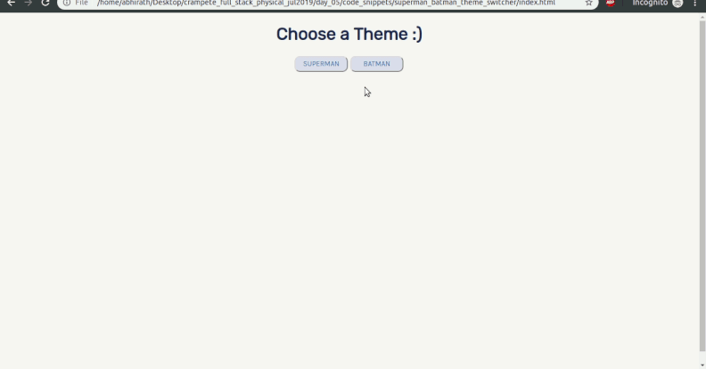
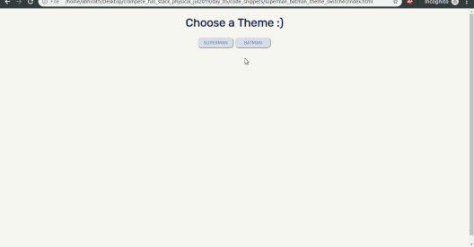

# Crampete Full Stack Classroom

### Batch - July, 2019

Homework, resources, code snippets, live projects and learning hacks can be found in the respective day folders.

## Index

- Day 5  
  

  - [Overview](#day-5-overview)
  - [Homework](day_05/homework.md)
  - [Logistics](day_05/logistics.md)
  - [Resources and Learning Hacks](day_05/resources-learning-hacks.md)
  - [Code](https://github.com/crampete/full_stack_classroom_july_2019/tree/master/day_05)

- Day 6

## Day 5 Overview

## Day 6 Overview
