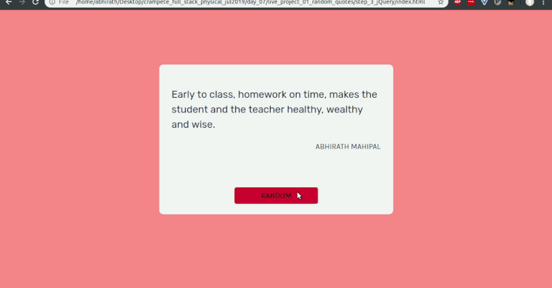
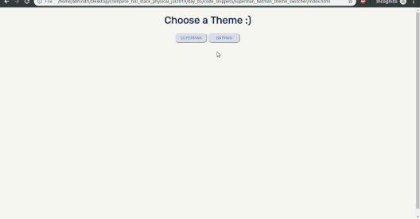
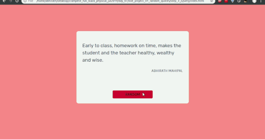

# Crampete Full Stack Classroom

### Batch - July, 2019

Homework, resources, code snippets, live projects and learning hacks can be found in the respective day folders.

## About

- [Extra Resources](extra-resources.md)
- [Project Selection](project-selection.md)
- [Goals](goals.md)

## Index

- Day 5 & Day 6

  

  - [Overview](#day-5---6-overview)
  - [Homework](day_05_n_06/homework.md)
  - [Logistics](day_05_n_06/logistics.md)
  - [Resources and Learning Hacks](day_05_n_06/resources-learning-hacks.md)
  - [Code](https://github.com/crampete/full_stack_classroom_july_2019/tree/master/day_05_n_06)

- Day 7

  

  - [Overview](#day-7-overview)
  - [Homework](day_07/homework.md)
  - [Logistics](day_07/logistics.md)
  - [Code](https://github.com/crampete/full_stack_classroom_july_2019/tree/master/day_07)

- Day 8

  - [Overview](#day-8-overview)
  - [Homework](day_08/homework.md)
  - [Code](https://github.com/crampete/full_stack_classroom_july_2019/tree/master/day_08)

- Day 9

  - [Overview](#day-9-overview)
  - [Homework](day_09/homework.md)
  - [Code](https://github.com/crampete/full_stack_classroom_july_2019/tree/master/day_09)

- Day 10

  - [Overview](#day-10-overview)
  - [Homework](day_10/homework.md)
  - [Code](https://github.com/crampete/full_stack_classroom_july_2019/tree/master/day_10)

- Day 11

  - [Overview](#day-11-overview)
  - [Homework](day_11/homework.md)
  - [Code](https://github.com/crampete/full_stack_classroom_july_2019/tree/master/day_11)

- Day 12
  

  - [Overview](#day-12-overview)
  - [Homework](day_12/homework.md)
  - [Code](https://github.com/crampete/full_stack_classroom_july_2019/tree/master/day_12)

- Day 17 & Day 18

  - [Overview](#day-17--18-overview)
  - [Homework](day_17_n_18/homework.md)
  - [Code](https://github.com/crampete/full_stack_classroom_july_2019/tree/master/day_17_n_18/code_snippets)

- Day 19 & Day 20

  - [Overview](#day-19--20-overview)
  - [Code](https://github.com/crampete/full_stack_classroom_july_2019/tree/master/day_19_n_20/code_snippets)

- Day 21 & Day 22
  - [Overview](#day-21--22-overview)
  - [Code](https://github.com/crampete/full_stack_classroom_july_2019/tree/master/day_21_n_22/code_snippets)
  - [Homework](day_21_n_22/homework.md)

## Day 5 & 6 Overview

### Day 5

- Individually identify what HTML, CSS and JavaScript do with analogies.
- JavaScript adds interactivity. Showed some examples (progress bars, form validation and a todo list DOM manipulation).
- Very brief intro on what is a computer langauge.
- JavaScript basics using an [online playground](https://wwww.playcode.io).

  - Variables, data types
  - `console.log`
  - Arrays and dictionaries (some operations on them as well)
  - Control statements (if, while and for) with simple examples

- Using inspect element to get a feel of the HTML, modify the nodes and CSS manually.
- Writing JavaScript code in the console.
- DOM in depth.
- Simple examples of modifying the DOM using JavaScript.
- Run through of HTML and CSS of `superman_batman_theme_switcher`.
- Concept of event listeners and what are JavaScript functions.
- Homework what is to be done, FreeCodeCamp, YouTube videos etc.

### Day 6

- Functions and Classes in depth.
- `document.getElementsByTagName()`, `document.getElementsById()` demystified.
- Superman Batman Theme Switcher project (see code_snippets_project).
- Step through using Google Chrome's console and seeing the changes live.
- Text Resizer run down in a similar fasion.

## Day 7 Overview

- Download VSCode and explore the code repo.
- Explain about code steps.
- Try recreating major portions of `live_project_01_random_quotes`. In the process
  - Tell them about Google Fonts
  - Colour schemes
- Use inspect elements to iterate faster with HTML and CSS changes.
- JavaScript linking and flow for project 1.
- HTML, CSS quickly go through `live_project_02_live_css_changer`.
- JavaScript breakdown
  - `onchange` eventlistener
  - `Math.random()` and `Math.floor()`

## Day 8 Overview

- Differences between Python and JavaScript in the browser (priviledges and access)
- Why Python, famous companies using Python.
- Python syntax with examples.
- Python data structures.
- Exploring Python using [Thonny](https://www.thonny.org).
- How the web works?
  - Network, IP and domains
  - What is the backend, frontend
  - Ports and web servers
  - Request and response (just communication)
  - Talking via the browser vs talking via curl
- File server using Python SimpleHTTPServer
- Controlling LED using a server and nodemcu.
- Simple Flask demo with two routes.

## Day 9 Overview

- What is a REPL? Using the Python REPL.
- Input and some operations on data structures.
- Simple functions in Python
- What is a CSV? Creating CSVs using Python.
- Code organisation. Breaking code into files and folders.
- Brief them about CodeChef, the certification and the opportunities they offer.

## Day 10 Overview

- Different types of clients (command line, web browser)
- Clear distinction between client and server. (Client Server model)
- Writing a few clients. [Code Here](https://github.com/crampete/full_stack_classroom_july_2019/tree/master/day_10/code_snippets/01_clients_python)
- Basic changes in any web application (Create, Read, Update and Delete) also called CRUD.
- Corresponding HTTP Verbs or Methods (GET, POST, PUT and DELETE).
- HTTP Status Codes overview.
- Google Chrome network inspection basics.
- Revision from last class
  - IP addresses are domains
  - Port Numbers
  - Request Response Lifecycle
  - Web Servers - What are they and why do we use them instead of writing them ourselves
  - Routes from a link
- Coding a simple backend. Writing a few endpoints and trying them out in the browser.

## Day 11 Overview

- Using Templates in Python for returning HTML.
- Why are templates better than HTML stored as strings.
- Reading CSVs using Python.
- Python Jinja Templates.
- Template with variables.
- Templates with for loops.

## Day 12 Overview

- What is mobile responsiveness and why?
- Use case for reset.css with a small demo.
- Websites are nothing but boxes.
- HTML for the [site](https://github.com/crampete/full_stack_classroom_july_2019/tree/master/day_12/code_snippets/responsive_plain_css).
- Touched upon semantic HTML.
- What is Bootstrap and you don't need it. You can write responsive with pure HTML and CSS alone.
- Brief intro to `rem` and why it's better than pixels. Less hard coding.
- Mobile First Approach in CSS.
- Code CSS using mobile first approach.
- CSS Media Queries and their uses (why those breakpoints?)
- Overwrite rules for certain devices using CSS.
- Block elements, inline elements and inline-block.
- `li + li` selector for margin spacing.
- How to link images, CSS files within HTML. Relative paths (coming out of folders using ../)

## Day 17 & 18 Overview

- Why Bootstrap and what is it?
- Bootstrap starter template to start coding.
- Reading documentation and using Bootstrap (navbar example)
- Bootstrap grid system. Thinking of websites like boxes and in terms of rows and columns.
- `rows` and `col` in Bootstrap
- Using different sizes like `xs`, `sm`, `md` and `lg`.
- `container` class.
- Fake text from Lorem Ipsum.
- Utility classes like `mt`, `mx`, `text-center` and so on.
- Photos from a stock photography website.
- Jumbotron with Background image.
- `offset-` and `img-fluid` in Bootstrap.
- Built the website given in code snippets using Bootstrap.

## Day 19 & 20 Overview

- React.js Intro.
- Intermingling HTML, CSS and JavaScript together.
- Node.js vs JavaScript on the browser.
- Brief intro to npm.
- Creating a new React.js project using `create-react-app`.
- React folder structure.
- Creating a React Component.
- Using Props in Components.
- Difference between state and props.
- E-commerce product page using state and props.
- Using npm to install 3rd party packages.
- Overview of `package.json` file.
- Jist of the `node_modules` folder.
- Creating multiple pages using `react-router-dom`.

## Day 21 & 22 Overview

- React Bootstrap.
- Using normal Bootstrap classes or React Components.
- Reading the documentation of React Bootstrap.
- Revisited `state` and `props`, when to use `props` and when to use `state` etc.
- Using state in input boxes (controlled components).
- Changing state via an `onChange` event listener.
- React router for login and profile pages.
- Why Git?
- Difference between Git and GitHub.
- Installing Git and choosing Visual Studio Code as the default editor.
- Git stage and commits.
- Making a new Git repo locally, pushing it to GitHub.
- Cloning a public repository using `git clone`.
- Updating code on one's local system using `git pull`.

## Day 23 & 24 Overview

- Revisited Mongo. Quick overview.
- Using a free cluster on Mongo Atlas.
- Using a GUI tool to work your way around Mongo.
- Basic connection using PyMongo.
- Choosing a collection and CRUD operations on the collection using various filters.
- Revisited IP Addresses and port number essentials.
- Revisited HTTP Routes and methods like GET, POST, PUT and DELETE.
- Creating RESTful routes (incomplete as of now) for a resource using Flask.
